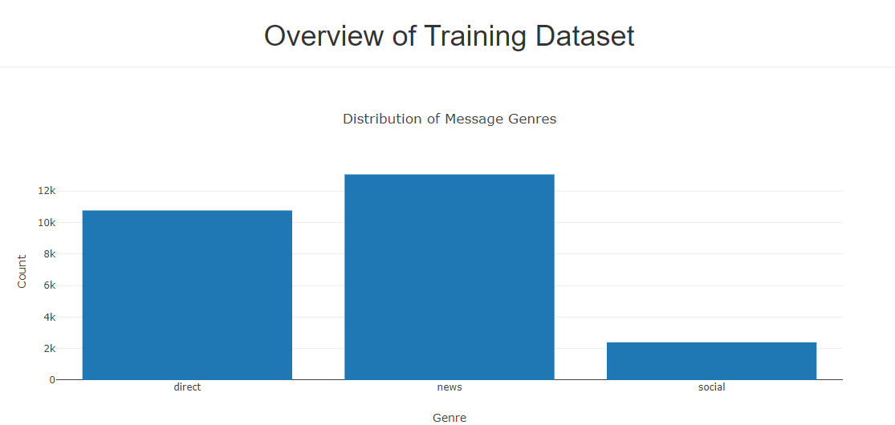
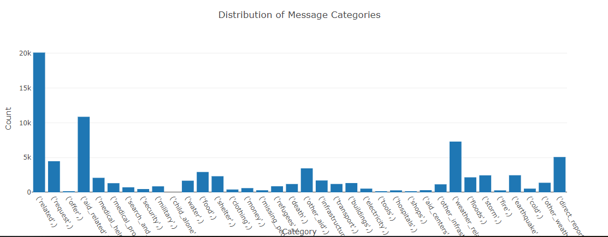
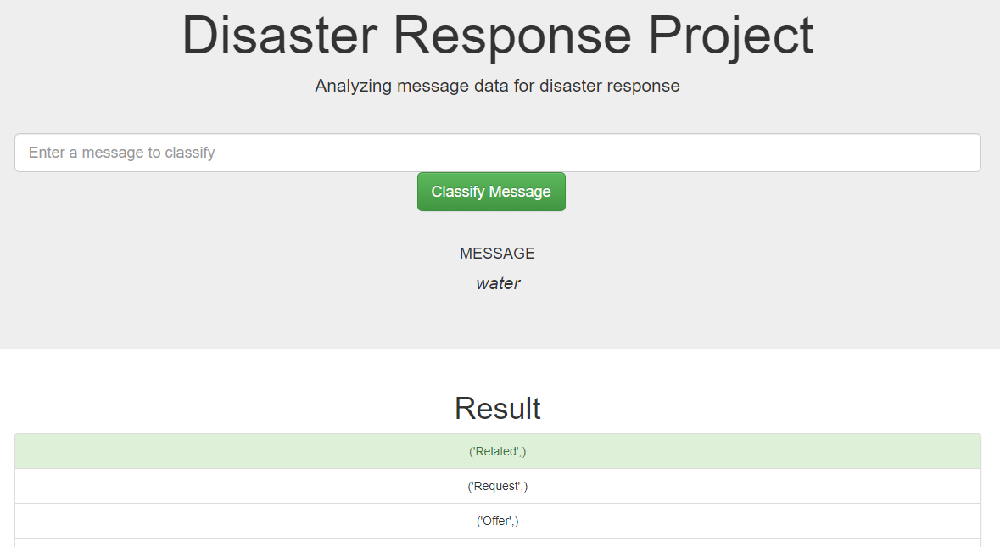

# Disaster Response Pipeline Project - Data Science UDACITY

## Project Description
I built a model, that helps classifying messages into categories that are sent during times of disasters. We are using a total of 36 default categories (e. g. Medical Products, Medical Help, etc.). THe objective of my model is to make sure that the messages are sent to the appropriate disaster relief agency

From a technical perspective, I built an ETL and ML pipeline to execute the needed steps, which allow sorting the input messaage to one or more categories. The used data was provided by Figure Eight, which allows to work on real messages from past disasters. 

In order to provide the user with a usability optimised entry point, I also created an app, which can be used to insert messages that will then in turn get classified.

## File Descriptions
1. app
    a. templates
        i. go.html
        ii. master.html
    b. run.py
2. data
    a. DisasterResponse.db
    b. ETL Pipeline Preparation.ipynb
    c. disaster_categories.csv
    d. disaster_messages.csv
    e. process_data.py
3. models
    a. ML Pipelone Preparation.ipynb
    b. classifier.pkl
    c. train_classifier.py
4. screenshot
    a. Screenshot_1.png
    b. Screenshot_2.png
    c. Screenshot_3.png
5. README.md

## Instructions
1. In order to use the projects output please run the following commands in the project's root directory to set up your database and model.

    - To run ETL pipeline that cleans data and stores in database
        `python data/process_data.py data/disaster_messages.csv data/disaster_categories.csv data/DisasterResponse.db`
    - To run ML pipeline that trains classifier and saves
        `python models/train_classifier.py data/DisasterResponse.db models/classifier.pkl`

2. Run the following command in the app's directory to run your web app.
    `python run.py`
    
3. Go to http://0.0.0.0:3001/

## Sceenshots

